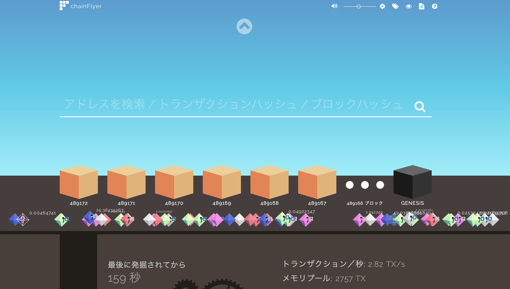

### BeerBash
### 2017/10/10
### 使ってみよう暗号通貨
### Shinohara Wataru

---

### 私

- ビッグデータ部
- レコメンドチーム
  - Kubernetes
  - Spinnaker
  - Istio
- 最近はずっとブロックチェーン

---

### 使ってみよう暗号通貨

- 注意
- ここでは暗号通貨(/=仮想通貨)って呼びます
- 日本銀行発行の紙幣も仮想だし

---

### 数多すぎ問題

<!-- .element height="60%" width="60%" -->

---

### 用語多すぎ問題

- ブロックチェーン？
- ビットコイン？
  - セグウィット
  - ライトニングネットワーク
  - アトミックスワップ
- 自分もそうでした(2014)
  - 飲みに行ったらwallet作らされてBTCで飲み代支払われたり
  - しかも秘密鍵無くした

---

### ビットコインとは

- 法定通貨ではない
- 電子マネーとの違いは？
  - 第三者に送金できる
  - 円と固定ではない
  - DMMポイントみたいに企業の保証がない
  - 管理者がいない

---

### 手に入れてみよう

- 採掘もできるけど
- 取引所に登録しよう

---

### 手に入れてみよう

### 国内

- bitflyer
- coincheck
- zaif
- bitbank

---

### 手に入れてみよう

### 海外

- poloniex
- bittrex
- bitfinex

---

### TOP 10

<!-- .element height="60%" width="60%" -->

---

### BTCが使えるところ

[coinmap.org](http://coinmap.org)

<!-- .element height="60%" width="60%" -->

---

### 保管に注意

- 秘密鍵を他人に教えてはいけない
  - 秘密鍵を知ってる人がコインを使える人
- [テレビでギフト用Bitcoinを見せたら、ソッコーで盗まれた](https://www.gizmodo.jp/2013/12/bitcoin_4.html)
- ハードウェアウォレットを使いましょう

<!-- .element height="40%" width="40%" -->

---

### 取引を見てみよう

[chainflyer](https://chainflyer.bitflyer.jp)

<!-- .element height="60%" width="60%" -->

---

### ブロック生成を見てみよう

[blockchaindemo](https://blockchaindemo.io)

<!-- .element height="60%" width="60%" -->

---

### 勉強しよう

- [SFCGC ブロックチェーン 寄附講座](http://gc.sfc.keio.ac.jp/cgi/class/class_top.cgi?2017_42470+)
- [ブロックチェーン入門](http://www.dmm.com/mono/book/-/detail/=/cid=bkt33601806/)
- [ブロックチェーン・レボリューション](https://book.dmm.com/detail/b980admod02598/)
- [ビットコインとブロックチェーン 暗号通貨を支える技術](http://www.dmm.com/mono/book/-/detail/=/cid=bkt33470294/)
- [Bitcoin and Cryptocurrency Technologies](https://www.coursera.org/learn/cryptocurrency)

---

### 投機対象として

- ホワイトペーパーは信用しない
- 市場規模は無視する
- 実績があるか確認する
- 自分が手に入れたら使うか考える
- 保有した場合の旨味があるか考える
- いつできるか調べる

---

### これは注意 

- セミナーで勧誘
- 価格保証
- 有名人が宣伝
- 専用 Slack チャネル

---

### 楽しい暗号通貨ライフを
